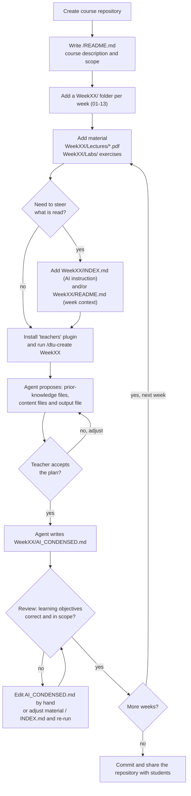
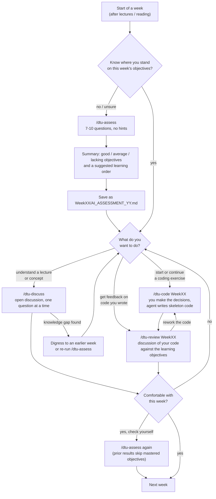

# Teaching skills for use for DTU students

A (hopefully) course agnostic teaching guide that
helps students use AI in a seamless and guided fashion.


## Installation

### Claude

```bash
claude plugin marketplace add dtudk/dtu-teaching-skills
claude plugin install students@dtu-teaching-skills
#claude plugin install teachers@dtu-teaching-skills
```


## Workflows

### Teacher

How a teacher prepares a course repository so the student skills can use it.
Weeks should be condensed in order, since `/dtu-create` reads the
`AI_CONDENSED.md` files of earlier weeks as prior knowledge.




### Students

How and when a student uses the skills in the `students` plugin during a week.
Each skill reads the course `README.md` and the `WeekXX/AI_CONDENSED.md` files.
Saved assessments (`WeekXX/AI_ASSESSMENT_YY.md`) let the other skills adapt to
what the student already knows.


